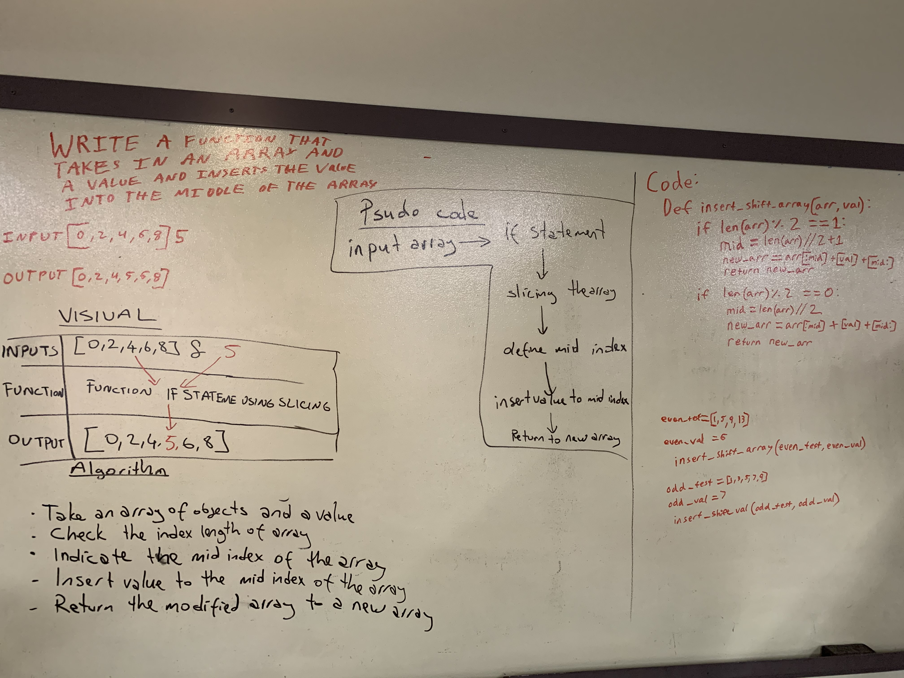

# Challenge Summary
Write a function that takes in an array and a value , then inserts the value into the middle index of the array.

## Challenge Description
Inseting a value into to the middle index of an array code-challenge which is solved by using slicing method and if statement with Python Language and test the function with pytest.

## Approach & Efficiency
First we take an array and a value. Then check the the index length of array. To make if statement whether the length of the array is even or odd number. Then slicing the array from middle of index according to even length number and odd length number and insert the value as a middle index number to this array and return as a new array. I test the function by 5 tests such as insert the value to even number length array, odd number legth array , single object array, empty array and string objects array.
The function passes these tests.

## Solution

