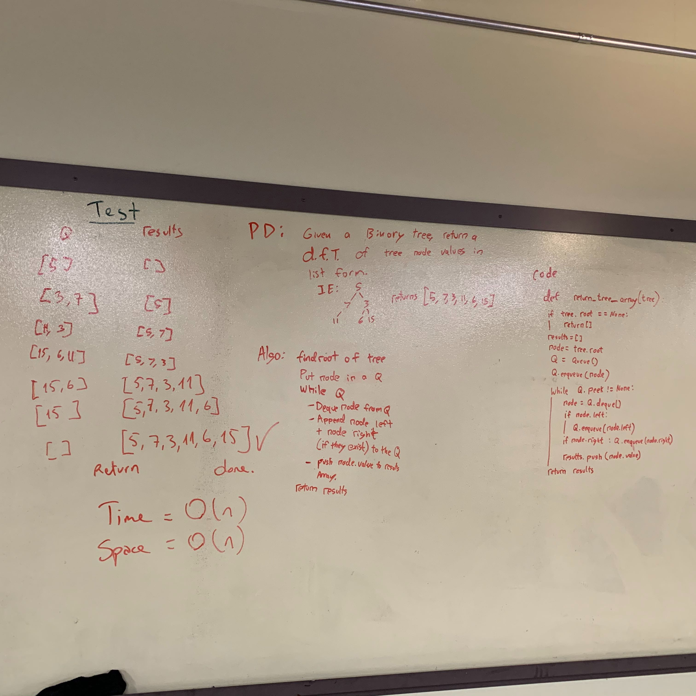

# breadth_first
breadth_first is a function in BinaryTree that nodes of a tree enqueue to Queue and dequeue from Queue to an array. 
## Challenge
Write a function breadth_first which takes a BinaryTree as its unique input and travers the tree to an array with Binary and Queue Class methods.
## Approach & Efficiency
breadth_first: Time: `O(n)`   Space: `O(n)`

## Solution

