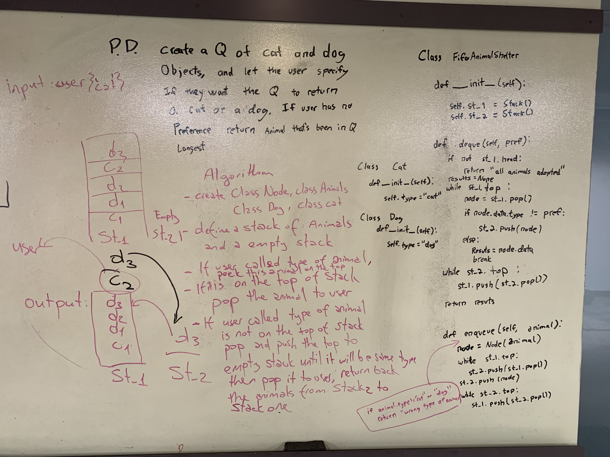

# fifo animal shelter
AnimalShelter class which has holds only cats and dogs. All shelter operations is only with first in first out approches
## Challenge
Write a function enqueue add animal to shelter which can be either dog or cat object with rulo of first in first out rule and another function dequeue returns either dog or cat also with rule of first in and first out rule
## Approach & Efficiency
Enqueue: Time: `O(n)`   Space: `O(1)` 
Dequeue: Time: `O(n)`   Space: `O(1)` 

## Solution

