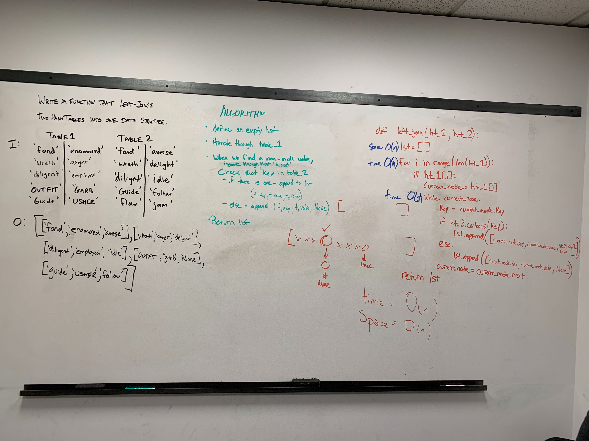

# left_join
Writing a function which takes two tables and left join the second table to first table if the key values of rows are same, if the key values are not matching adding it as None to this row of the column.

## Challenge
Try to solve this left join with Hash table class. 

## Approach & Efficiency
First declare an empty list of objects
Check each key of table one with table two with for loop,
While if the key is matching , create an object with key of table one , the value of key at table 1 and the value of same key at table two.
if key is not in the table, create an object with key of table one , the value of key at table 1 and None.
Return the list

## Solution
