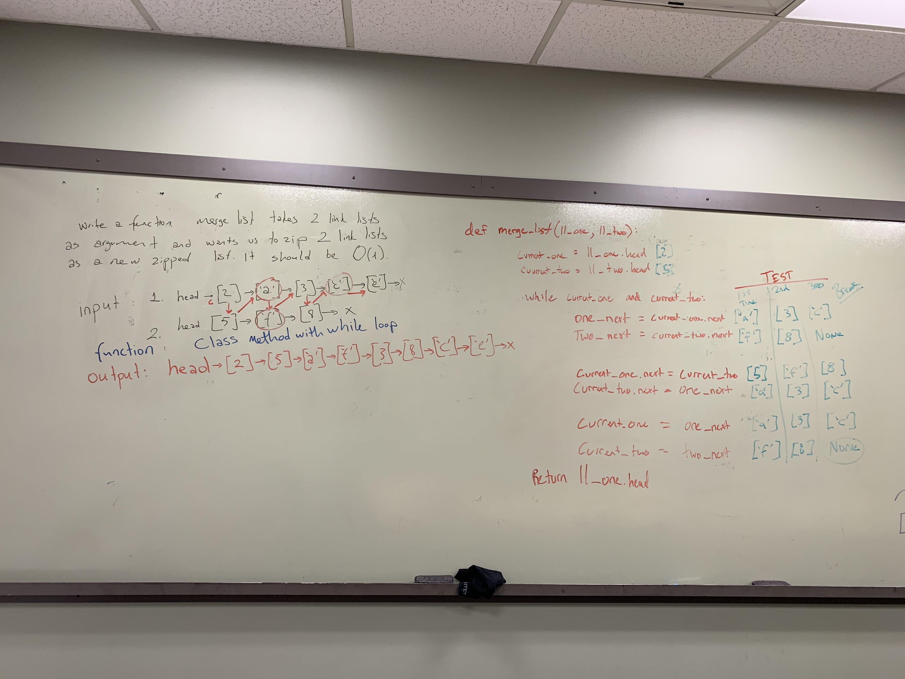

# Challenge Summary
Write a function that takes in 2 lists and merges them together.

## Challenge Description
Function will make zipped list which takes head of first list and make its own head and puts head of second list as second node , the next node will be second node of first list and the next next node will be second node of second one. This logic will continue until one of lists end. If the lengths of these 2 lists are different than each other, remaining nodes of long list will be added in their order to nodes of zipped list where the short one ends.

## Approach & Efficiency
Class method is used. Class of Node and Class of LinkedList created. The function is made with a while loop and if statements are used for edge cases.

## Solution
