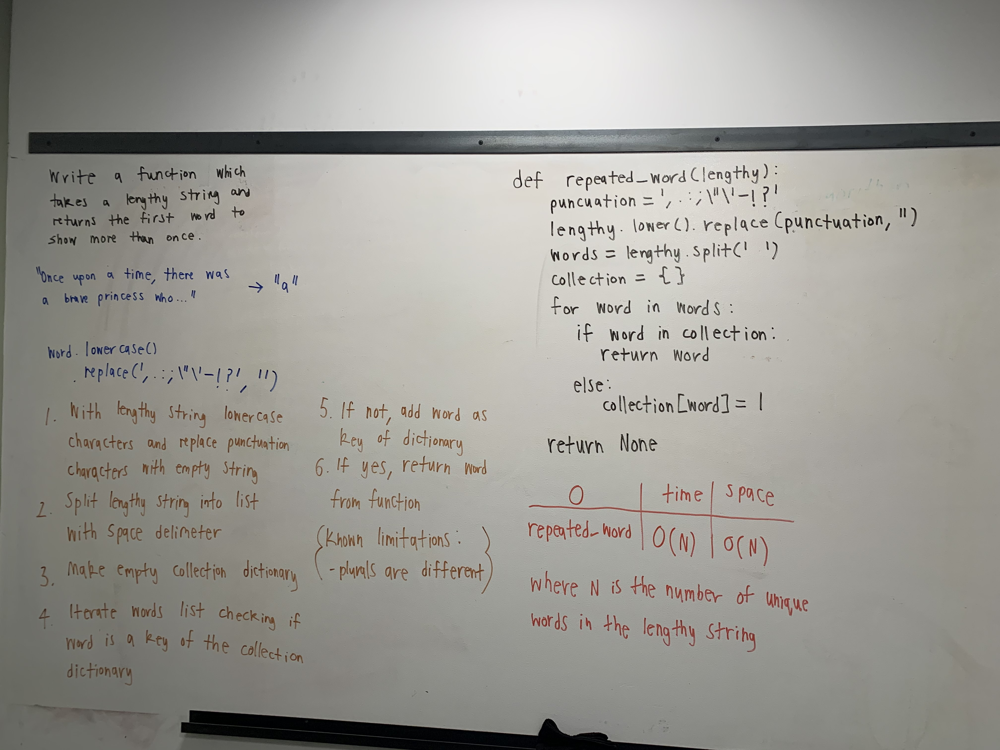

# Repeated Word
Writing a function which finds the most repeated word in a string

## Challenge
Try to solve this repeating word without any built in libraray. It is easy with an library

## Approach & Efficiency
First clear the string from puanctuation 
Make all lowercase to find all same words with or without capital letter
Split the words in strings
Conut the same words
Return the most repeated word

## Solution
